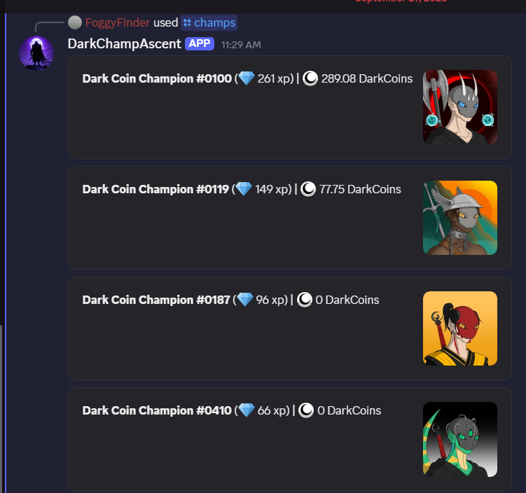
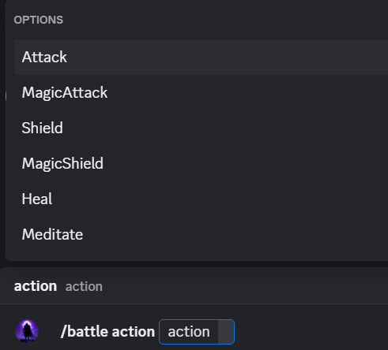
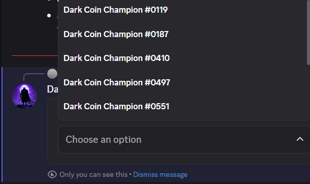
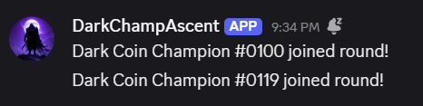
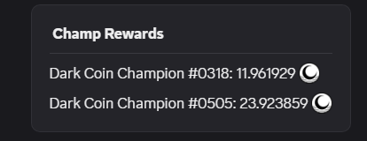

## Introduction

Dark Champ Ascent - discord game in early development stage that allows players to collect some DarkCoin.

---

To get started, you'll need to register your wallet with the bot by using the `/wallet register <paste your Algorand address here>` command.

For example `/wallet register G6YFTYHG5NGTRLUWYVZOY2OODHYJEFA4E57M4HN7NKP4NC3EUQJWMT5ZMA`

If everything goes smoothly, you'll receive a response:

> "Good, to confirm your wallet (`<address>`) send 0-cost Algo tx to `SZYECJF52SCJYMDQG4M3RGGLDTQPEEPTD36SW4PABEGZ6MCA4KH67QKRAU` with following note: `<numeric code>`"

Please follow the instructions carefully. Don't worry if you accidentally close the bot's response—you can always check your verification code later using the `/wallet wallets` command. For example:

> G3NP3JLN54YQMIV7DOHTDMPN5PHEO2MPRHFBBCWILWJVUD6AUKP4DEDHRE
>
> Confirmed: :x: (91349) | Active: :white_check_mark:

After sending your transaction, please give the bot 5-7 minutes to scan it and confirm your wallet. 

To check the status, simply re-run the `/wallet wallets` command. Your status should update at that time.

> G6YFTYHG5NGTRLUWYVZOY2OODHYJEFA4E57M4HN7NKP4NC3EUQJWMT5ZMA
> 
> Confirmed: :white_check_mark: | Active: :white_check_mark:

After confirming your wallet, the bot will fetch information about all your NFTs from the [Dark Coin Champions](https://www.asalytic.app/collection/dark-coin-champions) collection and generate characters with stats based on their traits.

To view the list of all registered characters, use the `/champs` command.

With at least one character, you can participate in automatic battles and earn some DarkCoins.

To join a battle, simply use the `/battle action` command

choose an action and then select an available champion from the list

If there is an active round, you'll see a 'Action is recorded' response and a message about which champion joined the round will appear in the `#dark-champ-ascent-logs` channel:

When a round finishes, messages with all the details will be posted to the `#dark-champ-ascent-battle` channel, for example:

For more information about the DarkChampAscent bot, see the [ReadMe](README.md)